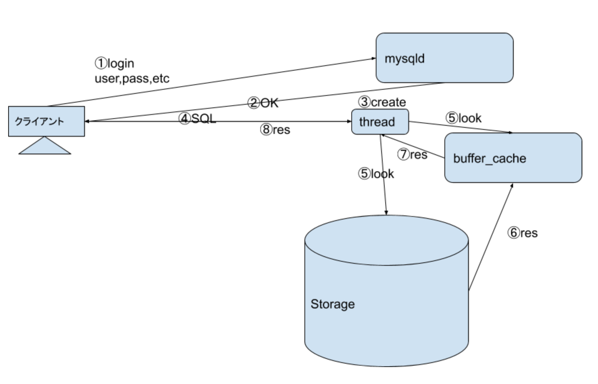

# RDBMS パフォーマンスチューニング入門 Part1

## 広義のパフォーマンスチューニングとは

- 確保したリソース(CPU、メモリ、Disk、NW など)でシステムを安定稼働させる、期待する時間で処理を行うための改善活動

- 改善活動を行うためにどのように稼働、処理を確認するか？
  - 監視により各種メトリクス、ミドルウェアの実行状況、サービスレベルでの死活監視など
    - 今回はミドルウェアの実行状況の文脈から SQL の実行状況をモニタリングする「スローログ」に触れます

## (今回のお題の)RDBMS パフォーマンスチューニングとは

大きくわけると 2 つのチューニングがあります

- SQL チューニング

  - SQL 文を意図した実行計画(アクセスパス)になるよう SQL 文の修正や誘導(ヒント句 インデックスの指定、駆動表の指定、探索アルゴリズムの指定など)、`または`インデックスを貼り走査のパフォーマンスチューニング(性能改善、性能最適)をはかるアプローチ
    - `または`と記載したがこれは`or`の関係ではなくどちらも用いることが多く`and`の関係
    - **今回はここを中心に入門します**

- システムチューニング

  - RDBMS のパラメータ(メモリ(共有、セッション固有など)、ファイルパス、何かしらの上限値(セッション数、プロセス数、スレッド数など)、アルゴリズム(LRU など)、その他)、下位レイヤのパラメータ(カーネルパラメータ(ファイルディスクリプタ、I/O スケジューラ、その他)、など)、ハードウェアの追加(CPU、メモリなど)や上位機種に変更などでパフォーマンスチューニング(性能改善、性能最適)をはかるアプローチ

- なぜ改善だけではなく最適と言う言葉を使ったか
  - SQL 文をチューニングしたとしても実際には様々な処理が同時実行されているなかで動作するため適切(最適)なリソースを用いて動作することが結果として重要になる。
    - Bad チューニングした SQL 文のせいで他の SQL 文が遅くなる

## 頭の片隅においておく観点

今回のパフォーマンスチューニングにて頭の片隅に置いておく観点

- レスポンスタイム

  - 入力が与えてから、反応を送り返すまでにかかるの時間のこと
    - OLTP(オンライン処理)、ユニークなデータを取り出す処理向き
      - INDEX を用いた探索
    - 今回の話はここを意識する話が中心です

- スループット

  - 単位時間あたりに処理できる量のこと
    - バッチ処理向きな観点

- I/O バウンド

  - 高ワークロード時に「DiskI/O」が性能の頭打ちになるケース
    - RDBMS は I/O バウンドに陥りやすい
      - 今回の話はここを意識する話となります

- CPU バウンド

  - 高ワークロード時に「CPU」が性能の頭打ちになるケース
    - Web サーバ、アプリケーションサーバなどは CPU バウンドに陥りやすい

- キャッシュヒット率

  - データをメモリからアクセスするコストを 1、ストレージからアクセスするコストを 100 と想定し、メモリにデータが存在しない場合ストレージにアクセスし得るものとする
    - ヒット率 100%の場合のコストは？ -> 100
    - ヒット率 99%の場合のコストは？ -> 99 + 100 -> 199
    - 必要なデータがメモリにあるのが好ましいイメージを持つ
      - ここで指すメモリとは？
        - RDBMS のバッファキャッシュ機能を指す。MySQL では`innodb_buffer_pool_size`など。メタな言葉で`共有メモリ`と呼ぶこともある

- 計算量
  - 線形探索 最良`0(1)`、最悪`O(N)`、平均`O(N/2)`
    - テーブルのフルスキャンは`O(N)`に近い
      - 計算量は 1 件のデータを突き止めるがフルスキャンは N 件のデータから M 件突き止めるので厳密には違う
        - N=M の検索結果を返すこともある
  - 二分木 `O(log2N)`
    - 今回学ぶ B+tree のベース

## MySQL アーキテクチャ

主に認証、認証後のクライアントからの SQL の要求、サーバ側の受け付け、レスポンスまでの基本的な動作について



今回主にチューニングで行う箇所は ④ ~ ⑧ での箇所で実行される SQL についてです。

- オプティマイザ
  - ④ ~ ⑧ ではオプティマイザと呼ばれる存在が SQL 文を解析後、最適なデータ走査方法の策定 = 実行計画の策定を行います。この実行計画を元にデータ走査が行われ ⑧ で結果(SELECT なら結果セットと実行結果、その他は実行結果)が返されます。
    - 今回の`最適`はレスポンスタイムが早くなることを前提に進めます

## 実演

これからする一連の流れを一旦実演

- スローログの設定確認

```
cat /etc/mysql/my.cnf

slow_query_log=ON
slow_query_log_file=/var/lib/mysql/slow.log
long_query_time=0.1
```

`my.cnf`の配置パスは以下で確認可能(今回は MySQL 作成時に存在した`/etc/mysql/my.cnf`に記述)

```
# mysql --help | grep my.cnf
                      order of preference, my.cnf, $MYSQL_TCP_PORT,
/etc/my.cnf /etc/mysql/my.cnf ~/.my.cnf
```

- スローログの出力内容を`tail`で確認

```
tail -f /var/lib/mysql/slow.log
```

- テーブル構成

```
show create table users;

CREATE TABLE `users` (
  `id` int NOT NULL AUTO_INCREMENT,
  `name` varchar(50) NOT NULL,
  `email` varchar(100) NOT NULL,
  `password` varchar(255) NOT NULL,
  `birthday` datetime NOT NULL,
  `profile1` text,
  `profile2` text,
  `created_at` datetime NOT NULL,
  `updated_at` datetime NOT NULL,
  PRIMARY KEY (`id`)
) ENGINE=InnoDB AUTO_INCREMENT=1000008 DEFAULT CHARSET=utf8mb3

1 row in set (0.01 sec)
```

- レコード数の確認

```
mysql> select count(*) from users;
+----------+
| count(*) |
+----------+
|  1000006 |
+----------+
1 row in set (12.05 sec)
```

- 今回チューニングする SQL の実行

```
mysql> select name from users where email = "o3xE22lXIlWJCdd@example.com";

+-----------------+
| name            |
+-----------------+
| o3xE22lXIlWJCdd |
+-----------------+
1 row in set (16.25 sec)
```

- スローログの出力内容を確認

  - 2 件出力されていること

```
# tail -f /var/lib/mysql/slow.log
# User@Host: root[root] @  [172.17.0.1]  Id:     8
# Query_time: 12.034466  Lock_time: 0.000113 Rows_sent: 1  Rows_examined: 0
use part1;
SET timestamp=1625534799;
select count(*) from users;
# Time: 2021-07-06T01:35:24.616980Z
# User@Host: root[root] @  [172.17.0.1]  Id:     8
# Query_time: 16.227654  Lock_time: 0.003036 Rows_sent: 1  Rows_examined: 1000006
SET timestamp=1625535308;
select name from users where email = "o3xE22lXIlWJCdd@example.com";
```

- explain の実行

```
mysql> explain select name from users where email = "o3xE22lXIlWJCdd@example.com"\G
*************************** 1. row ***************************
           id: 1
  select_type: SIMPLE
        table: users
   partitions: NULL
         type: ALL
possible_keys: NULL
          key: NULL
      key_len: NULL
          ref: NULL
         rows: 750105
     filtered: 10.00
        Extra: Using where
1 row in set, 1 warning (0.01 sec)
```

以降のチューニングはスローログ、Explain の章を学び再度実演にて解決します

## スローログ

RDBMS(MySQL)の性能改善に向けたロギング戦略、日々ロギングし性能改善の材料とする。スローログが起点となるケースもあるが、他のメトリクスで閾値を超えた時を起点として、その時刻前後にスローログにロギングされた SQL を確認することなどが多い

- スローログの設定方法
  - 出力可否、出力先(ファイルパス)、閾値(秒)の設定

```
/etc/mysql/my.cnf

[mysqld]
slow_query_log=ON
slow_query_log_file=/var/lib/mysql/slow.log
long_query_time=0.1
```

```
mysql> show variables like 'slow_query%';
+---------------------+-------------------------+
| Variable_name       | Value                   |
+---------------------+-------------------------+
| slow_query_log      | ON                      |
| slow_query_log_file | /var/lib/mysql/slow.log |
+---------------------+-------------------------+
2 rows in set (0.00 sec)

mysql> show variables like 'long%';
+-----------------+----------+
| Variable_name   | Value    |
+-----------------+----------+
| long_query_time | 0.100000 |
+-----------------+----------+
1 row in set (0.00 sec)
```

- 出力例  
  ターミナル 1(ターミナル　 2 で実行した SQL が閾値を超えた場合出力される。ここでは`select count(*) from users;`が実行された SQL が出力されている)

```
$ tail -f /var/lib/mysql/slow.log

# Time: 2021-07-06T01:26:51.852561Z
# User@Host: root[root] @  [172.17.0.1]  Id:     8
# Query_time: 12.034466  Lock_time: 0.000113 Rows_sent: 1  Rows_examined: 0
use part1;
SET timestamp=1625534799;
select count(*) from users;
```

- 実行 SQL
  ターミナル 2

```
mysql> show create table users;
mysql> select count(*) from users;
mysql> select name from users where email = "o3xE22lXIlWJCdd@example.com";
```

- 出力例
  - ターミナル 1 の出力結果より`# Query_time: 26.215280 `、`Rows_sent: 1 Rows_examined: 1000006`から実行時間約 26 秒、返したレコード 1 件、読み込んだレコード 1000006 件
    - `読み込んだレコード1000006件`を返したレコードに近づければ`# Query_time: 26.215280 `が縮小できると考える

```
# Time: 2020-07-03T02:25:07.797968Z
# User@Host: admin[admin] @ localhost []  Id:   260
# Query_time: 26.215280  Lock_time: 0.000258 Rows_sent: 1  Rows_examined: 1000006
SET timestamp=1593743081;
select name from users where mail = "o3xE22lXIlWJCdd@example.com";
```

## Explain

Explain は SQL 文の実行計画計画に関する情報を出力します。この出力結果から、ここでは基本的な実行計画の改善戦略について学んでいきます

- Explaine 出力例

```
mysql> explain select name from users where mail = "o3xE22lXIlWJCdd@example.com"\G
*************************** 1. row ***************************
           id: 1
  select_type: SIMPLE
        table: users
   partitions: NULL
         type: ALL
possible_keys: NULL
          key: NULL
      key_len: NULL
          ref: NULL
         rows: 717622
     filtered: 10.00
        Extra: Using where
1 row in set, 1 warning (0.03 sec)
```

- この出力結果からは、users テーブルから`table: users`、候補となる INDEX`possible_keys: NULL`が存在せず、実際に適用された INDEX もなく`key: NULL`、717622 件のレコードを走査`rows: 717622`したことがわかります
  - 注意 `rows: 717622`は統計値で実際には 1000006 レコード
  - スローログの章同様に返すレコードに`rows: 717622`を近づけることを考える

## B+tree INDEX アーキテクチャ

RDBMS ではテーブル探索の機能として B+tree(B\*tree)INDEX は(ほぼ)必ず実装されています。INDEX は RDBMS でのテーブル探索を行う上で、とても重要な機能です。

- どのように重要か？
  - 探索の際に`O(N)` -> `O(logFN*log2F)`に計算量を落とす
    - 大量のデータから少量のデータを探索する場合に有効
    - スローログ、Explain で解決したい課題`返すレコード`と`読み込むレコード`を近づけることができる

B+treeINDEX 図


B+treeINDEX の構造は簡単にあらわすと、このような図になります。二分木と違い、ブロックデバイスを前提に、格納効率の最大化を行い、探索時の計算量は`O(logFN*log2F)`となります。

- (注意)MySQL の PK は ClusteredINDEX のため leaf に Row(行)も格納される

- Unique、Non Unique の違い Next Look Up)
  - この図で示した B+treeINDEX では Unique 探索、Non Unique 探索のどちらも実現できます
    - Unique では対象にヒットしたら次を look up しません
    - Non Unique では対象にヒットしたあとも次を look up します。look up 時に値が違う場合、そこで look up を終了します

図中では INDEX から探索しデータにアクセス(ルックアップ)されるるまでに 5 ページ(ブロック)のアクセスで実現されています。

例として、テーブルレコードが 100 万件、テーブル容量が 1Gbyte のテーブルがあるとします。  
全レコードから特定の 1 件のレコードを要求した場合、計算量は O(n)になります。  
この場合 100 万件中の 1(もしくは n)件のデータを突き止めるために 1Gbyte の容量全てを走査して導き出します。  
これはいわゆる Full Scan の状態です。これを b+treeINDEX でこのテーブルを探索した場合、root,branch,leaf を探索し leaf から紐づくデータのアクセスで完了します。図中では 5 ページ(ブロック)のアクセスで導き出せています。この場合、root,branch,leaf,データ部のページサイズを 8Kbyte とした場合、40Kbyte のアクセスで探索が完了します。

この例で、100 万レコードから 1 件(もしくは n 件)のデータが導きだされるケースで Full Scan と INDEX 探索では`1Gbyte対40byte`のデータ容量の走査の差が性能差となって現れます。

- SQL でどのカラムを INDEX として貼るべきか？
  - 今回のスローログで見つかった SQL ならば`Where句`で指定されたカラムに設定するのが良い

## SQL パフォーマンスチューニング実演

ここからは FullScan の SQL(select 文)を explain で確認し確認する勘所、確認後の対策として B+treeINDEX を貼り、explain の内容の違い、検索時間の違いを見ていきます

- 確認 テーブルサイズ
  - ディクショナリを用いた算出方法もあるが今回は FS 上のファイルサイズで確認する

```
# ll /var/lib/mysql/part1/users.ibd
-rw-r----- 1 mysql mysql 4743757824 Jul  6 01:04 /var/lib/mysql/part1/users.ib
```

- 確認 テーブル構成

```
mysql> show create table users;

CREATE TABLE `users` (
  `id` int NOT NULL AUTO_INCREMENT,
  `name` varchar(50) NOT NULL,
  `email` varchar(100) NOT NULL,
  `password` varchar(255) NOT NULL,
  `birthday` datetime NOT NULL,
  `profile1` text,
  `profile2` text,
  `created_at` datetime NOT NULL,
  `updated_at` datetime NOT NULL,
  PRIMARY KEY (`id`)
) ENGINE=InnoDB AUTO_INCREMENT=1000008 DEFAULT CHARSET=utf8mb3

1 row in set (0.01 sec)
```

- 確認 レコード数(1000006 件)

```
mysql> select count(*) from users;
+----------+
| count(*) |
+----------+
|  1000006 |
+----------+
1 row in set (12.29 sec)
```

- 問題の SQL を実行
  - `1 row in set (14.01 sec)`に注目

```
mysql> select name from users where mail = "o3xE22lXIlWJCdd@example.com";
+-----------------+
| name            |
+-----------------+
| o3xE22lXIlWJCdd |
+-----------------+
1 row in set (14.01 sec)
```

- explain`rows`に注目しましょう(`rows: 716153`)

```
mysql> explain select name from users where mail = "o3xE22lXIlWJCdd@example.com"\G
*************************** 1. row ***************************
           id: 1
  select_type: SIMPLE
        table: users
   partitions: NULL
         type: ALL
possible_keys: NULL
          key: NULL
      key_len: NULL
          ref: NULL
         rows: 716153
     filtered: 10.00
        Extra: Using where
1 row in set, 1 warning (0.03 sec)
```

- INDEX の作成
  - 今回の話とはずれるが INDEX の作成時間は覚えておくことは大事
    - `Query OK, 0 rows affected (31.76 sec)`

```
mysql> alter table users add index mail(`mail`);
Query OK, 0 rows affected (31.76 sec)
Records: 0  Duplicates: 0  Warnings: 0
```

- 注意　今回 mail に INDEX を貼ったが Unique、Non Unique については検討していない
  - Unique INDEX の場合は以下

```
mysql> alter table users drop index mail;
mysql> alter table users add unique index mail(`mail`);
Query OK, 0 rows affected (31.78 sec)
Records: 0  Duplicates: 0  Warnings: 0
```

- explain`rows`に注目しましょう(`rows: 1`)

```
mysql> explain select name from users where mail = "o3xE22lXIlWJCdd@example.com"\G
*************************** 1. row ***************************
           id: 1
  select_type: SIMPLE
        table: users
   partitions: NULL
         type: ref
possible_keys: mail
          key: mail
      key_len: 302
          ref: const
         rows: 1
     filtered: 100.00
        Extra: NULL
1 row in set, 1 warning (0.01 sec)
```

- Extra の違いに注目
  - 古い Version だと`Using index,Using where`だったこともあり
    - カバリングインデックスなどと呼ばれる
    - これを応用すると今回の INDEX は`mail`のみで良いか？
      - ケースバイケースで`mail,name`が良い場合もある

```
mysql> explain select mail from users where mail = "o3xE22lXIlWJCdd@example.com"\G
*************************** 1. row ***************************
           id: 1
  select_type: SIMPLE
        table: users
   partitions: NULL
         type: ref
possible_keys: mail
          key: mail
      key_len: 302
          ref: const
         rows: 1
     filtered: 100.00
        Extra: Using index
1 row in set, 1 warning (0.00 sec)
```

- 問題の SQL を実行し実行時間から改善したことを確認
  - 1 row in set (0.00 sec)

```
mysql> select name from users where mail = "o3xE22lXIlWJCdd@example.com";
+-----------------+
| name            |
+-----------------+
| o3xE22lXIlWJCdd |
+-----------------+
1 row in set (0.00 sec)
```

- I/O が 717622 から 1 に減少(実際には 1000006 から 1)
  - ページの走査も全ページから INDEX(root,branch,leaf の 3~4 ページ) + レコードのページの 4~5 ページになった
    - 4261412864byte=4Gbyte から 8kbyte \* 4~5=32k~40kbyte

```
mysql> select count(*) from users;
+----------+
| count(*) |
+----------+
|  1000006 |
+----------+
1 row in set (26.05 sec)
```

## 余談

今回の SQL チューニングは INDEX を用いることで、以下を達成しレスポンスタイムを上げることができました

- 計算量を減らす
- 実際に走査するレコードを減らす
- 走査する容量を減らす

冒頭で`最適`と言う言葉に触れましたが`走査する容量を減らす`と言うのは共有メモリを最適な利用に近づけることに寄与していることに注目できると SQL チューニングとシステムチューニングを相互に俯瞰でき RDBMS チューニングの精度が上がっていきます。
