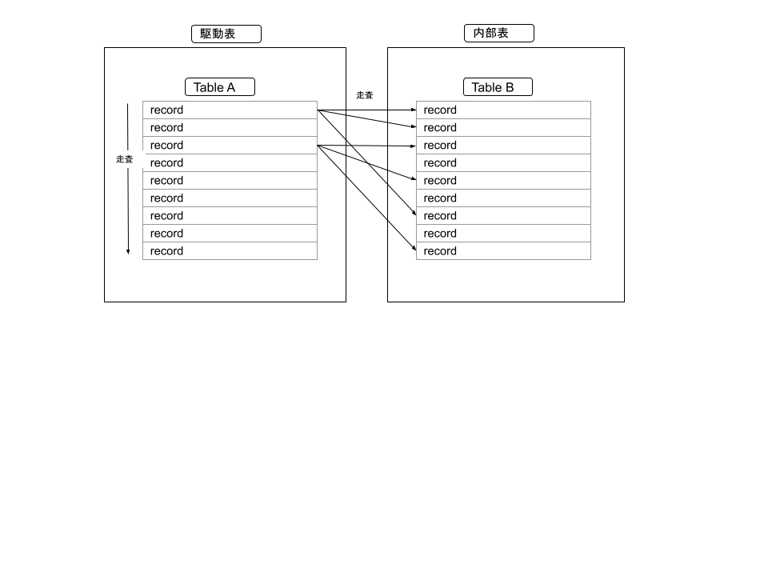
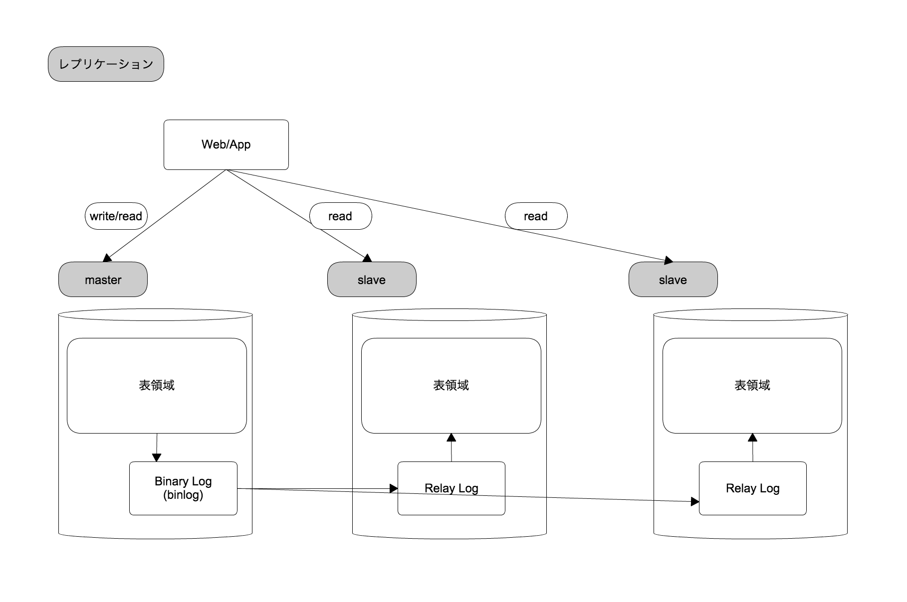
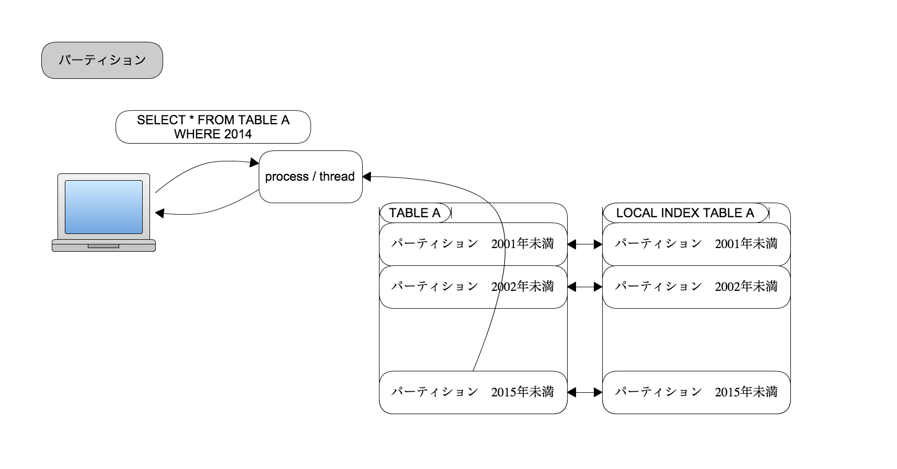
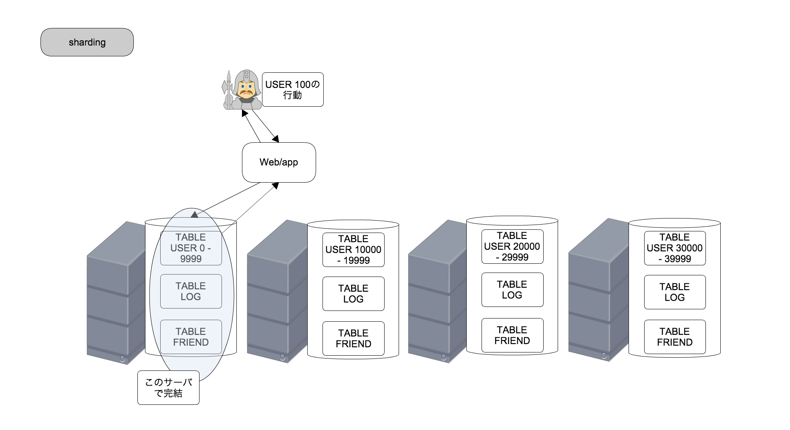

# RDBMS パフォーマンスチューニング入門 Part2

## 準備

実演を手元で動かしたい場合は[part0](./part0.md)を行うこと

## 今回利用するテーブル

親:users(id) - 子:messages(user_id)の関係(FK なし)

### テーブル定義

`users`

```
mysql> show create table users;

CREATE TABLE `users` (
  `id` int NOT NULL AUTO_INCREMENT,
  `name` varchar(50) NOT NULL,
  `email` varchar(100) NOT NULL,
  `password` varchar(255) NOT NULL,
  `birthday` datetime NOT NULL,
  `profile1` text,
  `profile2` text,
  `created_at` datetime NOT NULL,
  `updated_at` datetime NOT NULL,
  PRIMARY KEY (`id`)
) ENGINE=InnoDB AUTO_INCREMENT=1000008 DEFAULT CHARSET=utf8mb3

```

`messages`

```
mysql> show create table messages;

CREATE TABLE `messages` (
  `id` int NOT NULL AUTO_INCREMENT,
  `user_id` int NOT NULL,
  `title` varchar(100) NOT NULL,
  `message` text NOT NULL,
  `created_at` datetime NOT NULL,
  `updated_at` datetime NOT NULL,
  PRIMARY KEY (`id`)
) ENGINE=InnoDB AUTO_INCREMENT=1754074 DEFAULT CHARSET=utf8mb3
```

### 件数

`users`

```
mysql> select count(*) from users;
+----------+
| count(*) |
+----------+
|  1000006 |
+----------+
1 row in set (12.39 sec)

```

`messages`

```
mysql> select count(*) from messages;
+----------+
| count(*) |
+----------+
|  1754073 |
+----------+
1 row in set (0.87 sec)
```

## SQL テクニック&Tips

### Nested Loop Join の理解



Nested Loop Join について以下の SQL を例に解説

- 上絵では FullScan に見えるが実際は Index などで駆動表のレコードを特定、内部表への探索も Index で特定することが望ましい
- Nested Loop はクロス結合、内部結合、外部結合などの振る舞いがあるがまずは内部結合の動作の理解、内部結合で済むテーブル構造にすることが望ましい（上は内部結合の前提の絵）

```
mysql> select a.name ,b.message from messages b inner join users a on a.id = b.user_id and a.id = 1000001;
+---------+---------------------------+
| name    | message                   |
+---------+---------------------------+
| sunrise | Sunriseへようこそ！       |
+---------+---------------------------+
1 row in set (8.92 sec)
```

explain

```
mysql> explain select a.name ,b.message from messages b inner join users a on a.id = b.user_id and a.id = 1000001\G
*************************** 1. row ***************************
           id: 1
  select_type: SIMPLE
        table: a
   partitions: NULL
         type: const
possible_keys: PRIMARY
          key: PRIMARY
      key_len: 4
          ref: const
         rows: 1
     filtered: 100.00
        Extra: NULL
*************************** 2. row ***************************
           id: 1
  select_type: SIMPLE
        table: b
   partitions: NULL
         type: ALL
possible_keys: NULL
          key: NULL
      key_len: NULL
          ref: NULL
         rows: 1676140
     filtered: 10.00
        Extra: Using where
2 rows in set, 1 warning (0.00 sec)
```

チューニング

```
mysql> alter table messages add index user_id(user_id);
Query OK, 0 rows affected (4.85 sec)
Records: 0  Duplicates: 0  Warnings: 0
```

explain

```
mysql> explain select a.name ,b.message from messages b inner join users a on a.id = b.user_id and a.id = 1000001\G
*************************** 1. row ***************************
           id: 1
  select_type: SIMPLE
        table: a
   partitions: NULL
         type: const
possible_keys: PRIMARY
          key: PRIMARY
      key_len: 4
          ref: const
         rows: 1
     filtered: 100.00
        Extra: NULL
*************************** 2. row ***************************
           id: 1
  select_type: SIMPLE
        table: b
   partitions: NULL
         type: ref
possible_keys: user_id
          key: user_id
      key_len: 4
          ref: const
         rows: 1
     filtered: 100.00
        Extra: NULL
2 rows in set, 1 warning (0.00 sec)
```

取得時間(0.01 sec)

```
mysql> select a.name ,b.message from messages b inner join users a on a.id = b.user_id and a.id = 1000001;
+---------+---------------------------+
| name    | message                   |
+---------+---------------------------+
| sunrise | Sunriseへようこそ！       |
+---------+---------------------------+
1 row in set (0.01 sec)
```

### Multi Column Index

Multi Column Index(複数カラムで構成する INDEX)のカラムの列挙順について

例１(select 句は全てのカラム、検索条件は`birthday`と`name`での絞り込み)

```
select * from users where birthday = "1988-04-23 00:00:00" and name = "o3xE22lXIlWJCdd";
```

実際に検索

```
mysql> select * from users where birthday = "1988-04-23 00:00:00" and name = "o3xE22lXIlWJCdd";

... 割愛

1 row in set (18.53 sec)
```

explain で実行計画の確認

```
mysql> explain select * from users where birthday = "1988-04-23 00:00:00" and name = "o3xE22lXIlWJCdd"\G

*************************** 1. row ***************************
           id: 1
  select_type: SIMPLE
        table: users
   partitions: NULL
         type: ALL
possible_keys: NULL
          key: NULL
      key_len: NULL
          ref: NULL
         rows: 703878
     filtered: 1.00
        Extra: Using where
1 row in set, 1 warning (0.02 sec)

```

データ分布

```
mysql> select birthday , count(*) from users group by birthday;
+---------------------+----------+
| birthday            | count(*) |
+---------------------+----------+
| 1993-11-26 00:00:00 |       37 |
| 1968-08-14 00:00:00 |       43 |
| 1986-08-26 00:00:00 |       53 |
| 1957-06-07 00:00:00 |       43 |

.....

| 1944-09-30 00:00:00 |       24 |
| 1952-05-07 00:00:00 |       38 |
+---------------------+----------+
23726 rows in set (14.44 sec)

```

```
mysql> select count(*) from users where birthday = "1988-04-23 00:00:00";
+----------+
| count(*) |
+----------+
|       51 |
+----------+
1 row in set (11.68 sec)
```

```
mysql> select count(*) from users where name = "o3xE22lXIlWJCdd";
+----------+
| count(*) |
+----------+
|        1 |
+----------+
1 row in set (12.53 sec)
```

INDEX は絞り込みが効くカラムから指定し（今回だと name からが良さそう）作成

```
alter table users add index name_birthday(name,birthday);
```

実行計画の確認

```
mysql> explain select * from users where birthday = "1988-04-23 00:00:00" and name = "o3xE22lXIlWJCdd"\G
*************************** 1. row ***************************
           id: 1
  select_type: SIMPLE
        table: users
   partitions: NULL
         type: ref
possible_keys: name_birthday
          key: name_birthday
      key_len: 157
          ref: const,const
         rows: 1
     filtered: 100.00
        Extra: NULL
1 row in set, 1 warning (0.01 sec)
```

実際に検索

```
mysql> select * from users where birthday = "1988-04-23 00:00:00" and name = "o3xE22lXIlWJCdd";

...

1 row in set (0.00 sec)
```

` birthday``name `で作成し確認

```
alter table users add index birthday_name(birthday,name);
```

実行計画の確認(`name_birthday`が選択される)

```
mysql> explain select * from users where birthday = "1988-04-23 00:00:00" and name = "o3xE22lXIlWJCdd"\G
*************************** 1. row ***************************
           id: 1
  select_type: SIMPLE
        table: users
   partitions: NULL
         type: ref
possible_keys: name_birthday,birthday_name
          key: name_birthday
      key_len: 157
          ref: const,const
         rows: 1
     filtered: 100.00
        Extra: NULL
1 row in set, 1 warning (0.01 sec)
```

ヒント句で確認（use index)(※ヒント句は後で改めて触れる)

```
mysql> explain select * from users use index(birthday_name) where birthday = "1988-04-23 00:00:00" and name = "o3xE22lXIlWJCdd"\G
*************************** 1. row ***************************
           id: 1
  select_type: SIMPLE
        table: users
   partitions: NULL
         type: ref
possible_keys: birthday_name
          key: birthday_name
      key_len: 157
          ref: const,const
         rows: 1
     filtered: 100.00
        Extra: NULL
1 row in set, 1 warning (0.00 sec)
```

### カバリングインデックス

`Multi Column Index`の派生。INDEX で SELECT 句、条件句などをカバーしレコードまで探索をしないことでパフォーマンス向上を狙う

例

この場合だと name,email の 2 カラムだけで探索を完了できる

```

mysql> select name from users where email = "POCqOOm8flPwKGm@example.com";
+-----------------+
| name |
+-----------------+
| POCqOOm8flPwKGm |
+-----------------+
1 row in set (11.60 sec)

```

カバリングインデックスではない対応

```
mysql> alter table users add index email(email);
```

explain と検索結果(時間に注目)

```
mysql> explain select name from users where email = "POCqOOm8flPwKGm@example.com"\G
*************************** 1. row ***************************
           id: 1
  select_type: SIMPLE
        table: users
   partitions: NULL
         type: ref
possible_keys: email
          key: email
      key_len: 302
          ref: const
         rows: 1
     filtered: 100.00
        Extra: NULL
1 row in set, 1 warning (0.01 sec)

mysql> select name from users where email = "POCqOOm8flPwKGm@example.com";
+-----------------+
| name            |
+-----------------+
| POCqOOm8flPwKGm |
+-----------------+
1 row in set (0.01 sec)
```

カバリングインデックス

```
mysql> alter table users add index email_name(email,name);
```

explain と(`Extra: NULL`に注目)

```
mysql> explain select name from users where email = "POCqOOm8flPwKGm@example.com"\G
*************************** 1. row ***************************
           id: 1
  select_type: SIMPLE
        table: users
   partitions: NULL
         type: ref
possible_keys: email_name,email
          key: email
      key_len: 302
          ref: const
         rows: 1
     filtered: 100.00
        Extra: NULL
1 row in set, 1 warning (0.01 sec)
```

Index`email`が選択されるのでヒント句で確認(`Extra: Using index`に注目)

```
mysql> explain select name from users use index(email_name)  where email = "POCqOOm8flPwKGm@example.com"\G
*************************** 1. row ***************************
           id: 1
  select_type: SIMPLE
        table: users
   partitions: NULL
         type: ref
possible_keys: email_name
          key: email_name
      key_len: 302
          ref: const
         rows: 1
     filtered: 100.00
        Extra: Using index
1 row in set, 1 warning (0.00 sec)
```

検索結果(Index`email`)

```
mysql> select name from users where email = "POCqOOm8flPwKGm@example.com";
+-----------------+
| name            |
+-----------------+
| POCqOOm8flPwKGm |
+-----------------+
1 row in set (0.00 sec)
```

検索結果(Index`email_name`)

```
mysql> select name from users use index(email_name)  where email = "POCqOOm8flPwKGm@example.com";
+-----------------+
| name            |
+-----------------+
| POCqOOm8flPwKGm |
+-----------------+
1 row in set (0.00 sec)
```

### INDEX Sort

B+tree インデックスはソートされ格納されている特徴を利用したチューニング手法

例　昇順(asc)

```
mysql> select birthday,count(*) from users group by birthday order by birthday asc limit 10;
```

explain と実行結果

```
mysql> explain select birthday,count(*) from users group by birthday order by birthday asc limit 10\G
*************************** 1. row ***************************
           id: 1
  select_type: SIMPLE
        table: users
   partitions: NULL
         type: ALL
possible_keys: NULL
          key: NULL
      key_len: NULL
          ref: NULL
         rows: 703878
     filtered: 100.00
        Extra: Using temporary; Using filesort
1 row in set, 1 warning (0.01 sec)

mysql> select birthday,count(*) from users group by birthday order by birthday asc limit 10;
+---------------------+----------+
| birthday            | count(*) |
+---------------------+----------+
| 1934-11-17 00:00:00 |       48 |
| 1934-11-18 00:00:00 |       46 |
| 1934-11-19 00:00:00 |       53 |
| 1934-11-20 00:00:00 |       57 |
| 1934-11-21 00:00:00 |       39 |
| 1934-11-22 00:00:00 |       28 |
| 1934-11-23 00:00:00 |       31 |
| 1934-11-24 00:00:00 |       51 |
| 1934-11-25 00:00:00 |       44 |
| 1934-11-26 00:00:00 |       49 |
+---------------------+----------+
10 rows in set (9.53 sec)
```

例　降順(desc)

```
mysql> select birthday,count(*) from users group by birthday order by birthday desc limit 10;
```

降順　 explain と実行結果

```
mysql> explain select birthday,count(*) from users group by birthday order by birthday desc limit 10\G
*************************** 1. row ***************************
           id: 1
  select_type: SIMPLE
        table: users
   partitions: NULL
         type: ALL
possible_keys: NULL
          key: NULL
      key_len: NULL
          ref: NULL
         rows: 703878
     filtered: 100.00
        Extra: Using temporary; Using filesort
1 row in set, 1 warning (0.01 sec)

mysql> select birthday,count(*) from users group by birthday order by birthday desc limit 10;
+---------------------+----------+
| birthday            | count(*) |
+---------------------+----------+
| 1999-11-01 00:00:00 |       40 |
| 1999-10-31 00:00:00 |       47 |
| 1999-10-30 00:00:00 |       39 |
| 1999-10-29 00:00:00 |       44 |
| 1999-10-28 00:00:00 |       51 |
| 1999-10-27 00:00:00 |       32 |
| 1999-10-26 00:00:00 |       28 |
| 1999-10-25 00:00:00 |       38 |
| 1999-10-24 00:00:00 |       35 |
| 1999-10-23 00:00:00 |       37 |
+---------------------+----------+
10 rows in set (9.19 sec)
```

index 作成

```
mysql> alter table users add index birthday(birthday);
```

昇順　 explain と実行結果

```
mysql> explain select birthday,count(*) from users group by birthday order by birthday asc limit 10\G
*************************** 1. row ***************************
           id: 1
  select_type: SIMPLE
        table: users
   partitions: NULL
         type: index
possible_keys: birthday
          key: birthday
      key_len: 5
          ref: NULL
         rows: 10
     filtered: 100.00
        Extra: Using index
1 row in set, 1 warning (0.00 sec)

mysql> select birthday,count(*) from users group by birthday order by birthday asc limit 10;
+---------------------+----------+
| birthday            | count(*) |
+---------------------+----------+
| 1934-11-17 00:00:00 |       48 |
| 1934-11-18 00:00:00 |       46 |
| 1934-11-19 00:00:00 |       53 |
| 1934-11-20 00:00:00 |       57 |
| 1934-11-21 00:00:00 |       39 |
| 1934-11-22 00:00:00 |       28 |
| 1934-11-23 00:00:00 |       31 |
| 1934-11-24 00:00:00 |       51 |
| 1934-11-25 00:00:00 |       44 |
| 1934-11-26 00:00:00 |       49 |
+---------------------+----------+
10 rows in set (0.01 sec)
```

降順 explain(8.0 から`Backward index scan`が使える) と実行結果

```
mysql> explain select birthday,count(*) from users group by birthday order by birthday desc limit 10\G
*************************** 1. row ***************************
           id: 1
  select_type: SIMPLE
        table: users
   partitions: NULL
         type: index
possible_keys: birthday
          key: birthday
      key_len: 5
          ref: NULL
         rows: 10
     filtered: 100.00
        Extra: Backward index scan; Using index
1 row in set, 1 warning (0.01 sec)

mysql> select birthday,count(*) from users group by birthday order by birthday desc limit 10;
+---------------------+----------+
| birthday            | count(*) |
+---------------------+----------+
| 1999-11-01 00:00:00 |       40 |
| 1999-10-31 00:00:00 |       47 |
| 1999-10-30 00:00:00 |       39 |
| 1999-10-29 00:00:00 |       44 |
| 1999-10-28 00:00:00 |       51 |
| 1999-10-27 00:00:00 |       32 |
| 1999-10-26 00:00:00 |       28 |
| 1999-10-25 00:00:00 |       38 |
| 1999-10-24 00:00:00 |       35 |
| 1999-10-23 00:00:00 |       37 |
+---------------------+----------+
10 rows in set (0.01 sec)
```

### ヒント句

オプティマイザに対して SQL 文のアクセス(パス|順序)やインデックスの指定などの振る舞いの誘導ができる

USE INDEX

STRAIGHT_JOIN

### union による複数 INDEX

条件 A or 条件 B を A、B 各々に INDEX を貼り union で各々 INDEX SCAN を行う手法

## Insert 時のボトルネック

- PK の衝突

## レプリケーション



## パーティショニング



## シャーディング


