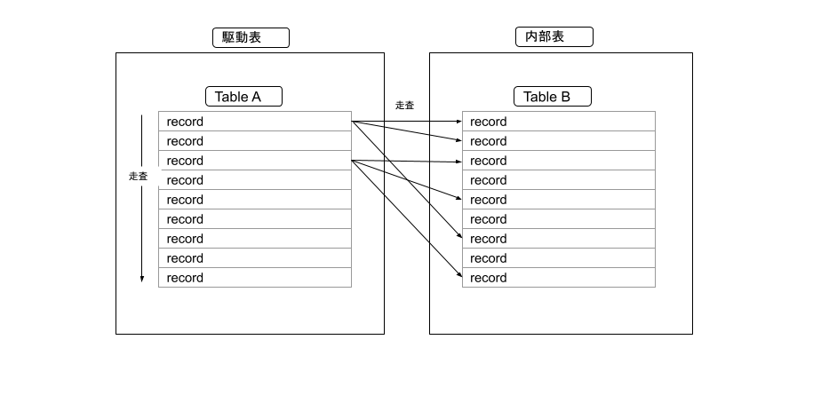

# RDBMS パフォーマンスチューニング入門 Part2

## 準備

実演を手元で動かしたい場合は[part0](./part0.md)を行うこと

## 今回利用するテーブル

親:users(id) - 子:messages(user_id)の関係(FK なし)

### テーブル定義

`users`(PK のみ)

```
mysql> show create table users;

CREATE TABLE `users` (
  `id` int NOT NULL AUTO_INCREMENT,
  `name` varchar(50) NOT NULL,
  `email` varchar(100) NOT NULL,
  `password` varchar(255) NOT NULL,
  `birthday` datetime NOT NULL,
  `profile1` text,
  `profile2` text,
  `created_at` datetime NOT NULL,
  `updated_at` datetime NOT NULL,
  PRIMARY KEY (`id`)
) ENGINE=InnoDB AUTO_INCREMENT=1000008 DEFAULT CHARSET=utf8mb3

```

`messages`(PK のみ)

```
mysql> show create table messages;

CREATE TABLE `messages` (
  `id` int NOT NULL AUTO_INCREMENT,
  `user_id` int NOT NULL,
  `title` varchar(100) NOT NULL,
  `message` text NOT NULL,
  `created_at` datetime NOT NULL,
  `updated_at` datetime NOT NULL,
  PRIMARY KEY (`id`)
) ENGINE=InnoDB AUTO_INCREMENT=1754074 DEFAULT CHARSET=utf8mb3
```

### 件数

`users`

```
mysql> select count(*) from users;
+----------+
| count(*) |
+----------+
|  1000006 |
+----------+
1 row in set (12.39 sec)

```

`messages`

```
mysql> select count(*) from messages;
+----------+
| count(*) |
+----------+
|  1754073 |
+----------+
1 row in set (0.87 sec)
```

## SQL テクニック&Tips

### Nested Loop Join の理解と基本的なSQLチューニング



上絵では FullScan に見えるが実際は Index などで駆動表のレコードを特定、内部表への探索も Index で特定することが望ましい  
Nested Loop Joinはクロス結合、内部結合、外部結合などの振る舞いがあるが内部結合で済むテーブル関係と構造にし内部結合では実現できないケースでクロス結合や外部結合を用いる、まずは内部結合の動作の理解を深めましょう（上は内部結合の前提の絵）

Nested Loop Join について以下の SQL を例に解説

#### 実行時間の確認

`messages b`と`users a`の内部結合、実行時間は`8.92 sec`

```
mysql> select a.name ,b.message from messages b inner join users a on a.id = b.user_id and a.id = 1000001;
+---------+---------------------------+
| name    | message                   |
+---------+---------------------------+
| sunrise | Sunriseへようこそ！       |
+---------+---------------------------+
1 row in set (8.92 sec)
```

#### 実行計画の確認(explain）

`users a`から走査(駆動表)し、次に`messages b`を走査している(Nested Loop Join)

※SQLの記述では`messages b`から`users a`を走査するよう記述されているがオプティマイザが決定したアクセスパスは異なっている

explainから`users a`はPKでアクセスし、`messages b`はINDEXは存在せずFull Scanとなっている

```
mysql> explain select a.name ,b.message from messages b inner join users a on a.id = b.user_id and a.id = 1000001\G
*************************** 1. row ***************************
           id: 1
  select_type: SIMPLE
        table: a
   partitions: NULL
         type: const
possible_keys: PRIMARY
          key: PRIMARY
      key_len: 4
          ref: const
         rows: 1
     filtered: 100.00
        Extra: NULL
*************************** 2. row ***************************
           id: 1
  select_type: SIMPLE
        table: b
   partitions: NULL
         type: ALL
possible_keys: NULL
          key: NULL
      key_len: NULL
          ref: NULL
         rows: 1676140
     filtered: 10.00
        Extra: Using where
2 rows in set, 1 warning (0.00 sec)
```

#### SQLチューニング
今回は上のexplainで`key`にINDEXが指定され、`rows`を取得するレコード数（今回は１レコード）に近づけるよう`messages b`にINDEXを作成する。

```
mysql> alter table messages add index user_id(user_id);
Query OK, 0 rows affected (4.85 sec)
Records: 0  Duplicates: 0  Warnings: 0
```

#### 実行計画の確認（explain)
explainから`key: user_id`,`rows: 1`と意図した実行計画になっている

```
mysql> explain select a.name ,b.message from messages b inner join users a on a.id = b.user_id and a.id = 1000001\G
*************************** 1. row ***************************
           id: 1
  select_type: SIMPLE
        table: a
   partitions: NULL
         type: const
possible_keys: PRIMARY
          key: PRIMARY
      key_len: 4
          ref: const
         rows: 1
     filtered: 100.00
        Extra: NULL
*************************** 2. row ***************************
           id: 1
  select_type: SIMPLE
        table: b
   partitions: NULL
         type: ref
possible_keys: user_id
          key: user_id
      key_len: 4
          ref: const
         rows: 1
     filtered: 100.00
        Extra: NULL
2 rows in set, 1 warning (0.00 sec)
```

#### 実行時間の確認
`0.01 sec`とパフォーマンスが改善していることがわかる

```
mysql> select a.name ,b.message from messages b inner join users a on a.id = b.user_id and a.id = 1000001;
+---------+---------------------------+
| name    | message                   |
+---------+---------------------------+
| sunrise | Sunriseへようこそ！       |
+---------+---------------------------+
1 row in set (0.01 sec)
```

### Multi Column Index

Multi Column Index(複数カラムで構成する INDEX)のカラムの列挙順について

#### 例

select 句は全てのカラム、検索条件は`birthday`と`name`での絞り込み

```
select * from users where birthday = "1988-04-23 00:00:00" and name = "o3xE22lXIlWJCdd";
```

#### 実行時間の確認

SQLでは条件句(where)に`birthday`と`name`の絞り込みが行われている

実行時間は`1 row in set (18.53 sec)`

```
mysql> select * from users where birthday = "1988-04-23 00:00:00" and name = "o3xE22lXIlWJCdd";

... 割愛

1 row in set (18.53 sec)
```

#### 実行計画の確認(explain)

`possible_keys: NULL`,`key: NULL`とINDEXの候補もなく使用されていない。1件のレコードを取得するのに`rows: 703878`(統計値)件読まれている。

```
mysql> explain select * from users where birthday = "1988-04-23 00:00:00" and name = "o3xE22lXIlWJCdd"\G

*************************** 1. row ***************************
           id: 1
  select_type: SIMPLE
        table: users
   partitions: NULL
         type: ALL
possible_keys: NULL
          key: NULL
      key_len: NULL
          ref: NULL
         rows: 703878
     filtered: 1.00
        Extra: Using where
1 row in set, 1 warning (0.02 sec)

```

#### データ分布の確認

条件句の`birthday`の分布を目視で確認。今回はバランス良くバラけているようである

```
mysql> select birthday , count(*) from users group by birthday;
+---------------------+----------+
| birthday            | count(*) |
+---------------------+----------+
| 1993-11-26 00:00:00 |       37 |
| 1968-08-14 00:00:00 |       43 |
| 1986-08-26 00:00:00 |       53 |
| 1957-06-07 00:00:00 |       43 |

.....

| 1944-09-30 00:00:00 |       24 |
| 1952-05-07 00:00:00 |       38 |
+---------------------+----------+
23726 rows in set (14.44 sec)

```

条件句で指定した`birthday = "1988-04-23 00:00:00"`でレコード数の確認(51件)

```
mysql> select count(*) from users where birthday = "1988-04-23 00:00:00";
+----------+
| count(*) |
+----------+
|       51 |
+----------+
1 row in set (11.68 sec)
```

条件句で指定した`name = "o3xE22lXIlWJCdd"`でレコード数の確認(1件)

```
mysql> select count(*) from users where name = "o3xE22lXIlWJCdd";
+----------+
| count(*) |
+----------+
|        1 |
+----------+
1 row in set (12.53 sec)
```

#### チューニング

INDEX は絞り込みが効くカラムから指定し`name,birthday`で（今回だと name の絞り込みが効く可能性が高いため先に指定）作成

```
alter table users add index name_birthday(name,birthday);
```

#### 実行計画の確認(explain)

```
mysql> explain select * from users where birthday = "1988-04-23 00:00:00" and name = "o3xE22lXIlWJCdd"\G
*************************** 1. row ***************************
           id: 1
  select_type: SIMPLE
        table: users
   partitions: NULL
         type: ref
possible_keys: name_birthday
          key: name_birthday
      key_len: 157
          ref: const,const
         rows: 1
     filtered: 100.00
        Extra: NULL
1 row in set, 1 warning (0.01 sec)
```

#### 実行時間の確認

`1 row in set (0.00 sec)`とチューニングが成功している

```
mysql> select * from users where birthday = "1988-04-23 00:00:00" and name = "o3xE22lXIlWJCdd";

省略...

1 row in set (0.00 sec)
```

#### 別のINDEXの作成

`name,birthday`の逆で`birthday,name `で作成し確認

```
alter table users add index birthday_name(birthday,name);
```

#### 実行計画の確認(explain)

`name_birthday`が選択され`rows: 1`で意図した通りの実行計画になる

```
mysql> explain select * from users where birthday = "1988-04-23 00:00:00" and name = "o3xE22lXIlWJCdd"\G
*************************** 1. row ***************************
           id: 1
  select_type: SIMPLE
        table: users
   partitions: NULL
         type: ref
possible_keys: name_birthday,birthday_name
          key: name_birthday
      key_len: 157
          ref: const,const
         rows: 1
     filtered: 100.00
        Extra: NULL
1 row in set, 1 warning (0.01 sec)
```

#### ヒント句

ヒント句を用いて選択されなかった`birthday_name`を指定し実行計画ので確認（use index)(※ヒント句については後で改めて触れる)

```
mysql> explain select * from users use index(birthday_name) where birthday = "1988-04-23 00:00:00" and name = "o3xE22lXIlWJCdd"\G
*************************** 1. row ***************************
           id: 1
  select_type: SIMPLE
        table: users
   partitions: NULL
         type: ref
possible_keys: birthday_name
          key: birthday_name
      key_len: 157
          ref: const,const
         rows: 1
     filtered: 100.00
        Extra: NULL
1 row in set, 1 warning (0.00 sec)
```

#### 実行結果

`birthday_name`でもパフォーマンスは良好である

```
mysql> select * from users use index(birthday_name) where birthday = "1988-04-23 00:00:00" and name = "o3xE22lXIlWJCdd";

省略...

1 row in set (0.00 sec)
```

### カバリングインデックス

`Multi Column Index`の派生。INDEX で SELECT 句、条件句などをカバーしレコードまで探索をしないことでパフォーマンス向上を狙う

#### 例

条件句(`where`)に`email`が指定され、結果セット(`select`句)に`name`が返されている。
実行時間は`1 row in set (11.60 sec)`掛かっている。

```

mysql> select name from users where email = "POCqOOm8flPwKGm@example.com";
+-----------------+
| name |
+-----------------+
| POCqOOm8flPwKGm |
+-----------------+
1 row in set (11.60 sec)

```

#### チューニング(カバリングインデックスの作成)

今回のケースでは `name`,`email` の 2 カラムでINDEXを作成することでINDEXだけで探索を完了できる。この手法をカバリングインデックスと言う

```
mysql> alter table users add index email_name(email,name);
```

#### 実行計画(explain)

`Extra: Using index`に注目

```
mysql> explain select name from users where email = "POCqOOm8flPwKGm@example.com"\G
*************************** 1. row ***************************
           id: 1
  select_type: SIMPLE
        table: users
   partitions: NULL
         type: ref
possible_keys: email_name
          key: email_name
      key_len: 302
          ref: const
         rows: 1
     filtered: 100.00
        Extra: Using index
1 row in set, 1 warning (0.01 sec)
```

#### 実行結果

`1 row in set (0.01 sec)`に注目

```
mysql> select name from users where email = "POCqOOm8flPwKGm@example.com";
+-----------------+
| name            |
+-----------------+
| POCqOOm8flPwKGm |
+-----------------+
1 row in set (0.01 sec)
```


#### 一旦インデックスの削除

別のINDEXを評価するため`email_name`の削除

```
mysql> alter table users drop index email_name;
Query OK, 0 rows affected (0.03 sec)
Records: 0  Duplicates: 0  Warnings: 0
```

#### インデックスの作成

条件句(`where`)で指定されている`email`のみでINDEXの作成

```
mysql> alter table users add index email(email);
```

#### 実行計画(explain)

`Extra: NULL`に注目

```
mysql> explain select name from users where email = "POCqOOm8flPwKGm@example.com"\G
*************************** 1. row ***************************
           id: 1
  select_type: SIMPLE
        table: users
   partitions: NULL
         type: ref
possible_keys: email
          key: email
      key_len: 302
          ref: const
         rows: 1
     filtered: 100.00
        Extra: NULL
1 row in set, 1 warning (0.00 sec)
```

#### 実行結果

`1 row in set (0.01 sec)`に注目

```
mysql> select name from users where email = "POCqOOm8flPwKGm@example.com";
+-----------------+
| name            |
+-----------------+
| POCqOOm8flPwKGm |
+-----------------+
1 row in set (0.01 sec)
```

#### カバリングインデックスの作成

改めてカバリングインデックスを作成する

```
mysql> alter table users add index email_name(email,name);
```

#### 実行計画(explain)

`key: email`に注目(`email`が選択されている)

```
mysql> explain select name from users where email = "POCqOOm8flPwKGm@example.com"\G
*************************** 1. row ***************************
           id: 1
  select_type: SIMPLE
        table: users
   partitions: NULL
         type: ref
possible_keys: email,email_name
          key: email
      key_len: 302
          ref: const
         rows: 1
     filtered: 100.00
        Extra: NULL
1 row in set, 1 warning (0.00 sec)
```

#### 実行計画(explain)その２

ヒント句を用い`email_name`を選択させる

```
mysql> explain select name from users use index(email_name) where email = "POCqOOm8flPwKGm@example.com"\G
*************************** 1. row ***************************
           id: 1
  select_type: SIMPLE
        table: users
   partitions: NULL
         type: ref
possible_keys: email_name
          key: email_name
      key_len: 302
          ref: const
         rows: 1
     filtered: 100.00
        Extra: Using index
1 row in set, 1 warning (0.00 sec)
```

#### どちらが良いか？

ケースバイケース。このケースでは`explain`だけでの評価ではなく、システムの稼働状況やメモリのキャッシュ状況なども加え総合的に評価することが望ましい(一般論としては`where句だけのINDEX` -> `カバリングインデックス`)

### INDEX Sort

B+tree インデックスはソートされ格納される仕様を利用したチューニング手法

#### INDEXの削除

前のチューニングで作成した`name_birthday`,`birthday_name`を一旦削除

```
alter table users drop index name_birthday;
alter table users drop index birthday_name;
```

#### 例(昇順(asc))

```
mysql> select birthday,count(*) from users group by birthday order by birthday asc limit 10;
```

#### 実行計画(explain)

`key: NULL`とFull Scanで統計値`rows: 703878`のレコードにアクセスしている


```
mysql> explain select birthday,count(*) from users group by birthday order by birthday asc limit 10\G
*************************** 1. row ***************************
           id: 1
  select_type: SIMPLE
        table: users
   partitions: NULL
         type: ALL
possible_keys: NULL
          key: NULL
      key_len: NULL
          ref: NULL
         rows: 703878
     filtered: 100.00
        Extra: Using temporary; Using filesort
1 row in set, 1 warning (0.01 sec)
```

####  実行結果

`limit 10`でN件から10件のレコードを取得に`10 rows in set (9.53 sec)`掛かっている

```
mysql> select birthday,count(*) from users group by birthday order by birthday asc limit 10;
+---------------------+----------+
| birthday            | count(*) |
+---------------------+----------+
| 1934-11-17 00:00:00 |       48 |
| 1934-11-18 00:00:00 |       46 |
| 1934-11-19 00:00:00 |       53 |
| 1934-11-20 00:00:00 |       57 |
| 1934-11-21 00:00:00 |       39 |
| 1934-11-22 00:00:00 |       28 |
| 1934-11-23 00:00:00 |       31 |
| 1934-11-24 00:00:00 |       51 |
| 1934-11-25 00:00:00 |       44 |
| 1934-11-26 00:00:00 |       49 |
+---------------------+----------+
10 rows in set (9.53 sec)
```

#### 例(降順(desc))

```
mysql> select birthday,count(*) from users group by birthday order by birthday desc limit 10;
```

#### explain

`key: NULL`とFull Scanで統計値`rows: 703878`のレコードにアクセスしている

```
mysql> explain select birthday,count(*) from users group by birthday order by birthday desc limit 10\G
*************************** 1. row ***************************
           id: 1
  select_type: SIMPLE
        table: users
   partitions: NULL
         type: ALL
possible_keys: NULL
          key: NULL
      key_len: NULL
          ref: NULL
         rows: 703878
     filtered: 100.00
        Extra: Using temporary; Using filesort
1 row in set, 1 warning (0.01 sec)
```

#### 実行結果

`limit 10`でN件から10件のレコードを取得に`10 rows in set (9.19 sec)`掛かっている

```
mysql> select birthday,count(*) from users group by birthday order by birthday desc limit 10;
+---------------------+----------+
| birthday            | count(*) |
+---------------------+----------+
| 1999-11-01 00:00:00 |       40 |
| 1999-10-31 00:00:00 |       47 |
| 1999-10-30 00:00:00 |       39 |
| 1999-10-29 00:00:00 |       44 |
| 1999-10-28 00:00:00 |       51 |
| 1999-10-27 00:00:00 |       32 |
| 1999-10-26 00:00:00 |       28 |
| 1999-10-25 00:00:00 |       38 |
| 1999-10-24 00:00:00 |       35 |
| 1999-10-23 00:00:00 |       37 |
+---------------------+----------+
10 rows in set (9.19 sec)
```

#### チューニング

`birthday`にINDEXを作成する

```
mysql> alter table users add index birthday(birthday);
```

#### 昇順の実行計画(explain)

`key: birthday` とINDEXを利用してテーブル走査している。`rows: 10`と必要最低限のアクセスに留めている。

```
mysql> explain select birthday,count(*) from users group by birthday order by birthday asc limit 10\G
*************************** 1. row ***************************
           id: 1
  select_type: SIMPLE
        table: users
   partitions: NULL
         type: index
possible_keys: birthday
          key: birthday
      key_len: 5
          ref: NULL
         rows: 10
     filtered: 100.00
        Extra: Using index
1 row in set, 1 warning (0.00 sec)
```

#### 実行結果

`10 rows in set (0.01 sec)`でレコードを返している

```
mysql> select birthday,count(*) from users group by birthday order by birthday asc limit 10;
+---------------------+----------+
| birthday            | count(*) |
+---------------------+----------+
| 1934-11-17 00:00:00 |       48 |
| 1934-11-18 00:00:00 |       46 |
| 1934-11-19 00:00:00 |       53 |
| 1934-11-20 00:00:00 |       57 |
| 1934-11-21 00:00:00 |       39 |
| 1934-11-22 00:00:00 |       28 |
| 1934-11-23 00:00:00 |       31 |
| 1934-11-24 00:00:00 |       51 |
| 1934-11-25 00:00:00 |       44 |
| 1934-11-26 00:00:00 |       49 |
+---------------------+----------+
10 rows in set (0.01 sec)
```

#### 降順の実行計画(explain)

8.0 から`Backward index scan`が使える

`key: birthday`とINDEXを利用してテーブル走査している。`rows: 10`と必要最低限のアクセスに留めている。

```
mysql> explain select birthday,count(*) from users group by birthday order by birthday desc limit 10\G
*************************** 1. row ***************************
           id: 1
  select_type: SIMPLE
        table: users
   partitions: NULL
         type: index
possible_keys: birthday
          key: birthday
      key_len: 5
          ref: NULL
         rows: 10
     filtered: 100.00
        Extra: Backward index scan; Using index
1 row in set, 1 warning (0.01 sec)
```

#### 実行結果

`10 rows in set (0.01 sec)`でレコードを返している

```
mysql> select birthday,count(*) from users group by birthday order by birthday desc limit 10;
+---------------------+----------+
| birthday            | count(*) |
+---------------------+----------+
| 1999-11-01 00:00:00 |       40 |
| 1999-10-31 00:00:00 |       47 |
| 1999-10-30 00:00:00 |       39 |
| 1999-10-29 00:00:00 |       44 |
| 1999-10-28 00:00:00 |       51 |
| 1999-10-27 00:00:00 |       32 |
| 1999-10-26 00:00:00 |       28 |
| 1999-10-25 00:00:00 |       38 |
| 1999-10-24 00:00:00 |       35 |
| 1999-10-23 00:00:00 |       37 |
+---------------------+----------+
10 rows in set (0.01 sec)
```

#### INDEXの作成

一旦削除したINDEXを再作成
```
alter table users add index name_birthday(name,birthday);
alter table users add index birthday_name(birthday,name);
```

#### 昇順の実行計画(explain)

念のため確認

```
mysql> explain select birthday,count(*) from users group by birthday order by birthday asc limit 10\G
*************************** 1. row ***************************
           id: 1
  select_type: SIMPLE
        table: users
   partitions: NULL
         type: index
possible_keys: birthday,name_birthday,birthday_name
          key: birthday
      key_len: 5
          ref: NULL
         rows: 10
     filtered: 100.00
        Extra: Using index
1 row in set, 1 warning (0.00 sec)
```

#### 降順の実行計画(explain)

念のため確認

```
mysql> explain select birthday,count(*) from users group by birthday order by birthday desc limit 10\G
*************************** 1. row ***************************
           id: 1
  select_type: SIMPLE
        table: users
   partitions: NULL
         type: index
possible_keys: birthday,name_birthday,birthday_name
          key: birthday
      key_len: 5
          ref: NULL
         rows: 10
     filtered: 100.00
        Extra: Backward index scan; Using index
1 row in set, 1 warning (0.00 sec)
```

### ヒント句

オプティマイザに対して SQL 文のアクセス(パス|順序)やインデックスの指定などの振る舞いの誘導ができる

#### USE INDEX その１

`use index(birthday_name)`で`birthday_name`を指定しテーブル走査させる

```
mysql> select * from users use index(birthday_name) where birthday = "1988-04-23 00:00:00" and name = "o3xE22lXIlWJCdd";

...省略

1 row in set (0.01 sec)
```

#### 実行計画

`key: birthday_name`で選択されている

```
mysql> explain select * from users use index(birthday_name) where birthday = "1988-04-23 00:00:00" and name = "o3xE22lXIlWJCdd"\G
*************************** 1. row ***************************
           id: 1
  select_type: SIMPLE
        table: users
   partitions: NULL
         type: ref
possible_keys: birthday_name
          key: birthday_name
      key_len: 157
          ref: const,const
         rows: 1
     filtered: 100.00
        Extra: NULL
1 row in set, 1 warning (0.01 sec)
```

#### USE INDEX その２

`use index(email_name)`で`email_name`を指定しテーブル走査させる

```
mysql> select name from users use index(email_name)  where email = "POCqOOm8flPwKGm@example.com";
+-----------------+
| name            |
+-----------------+
| POCqOOm8flPwKGm |
+-----------------+
1 row in set (0.00 sec)
```

#### 実行計画

`key: email_name`で選択されている

```
mysql> explain select name from users use index(email_name) where email = "POCqOOm8flPwKGm@example.com"\G
*************************** 1. row ***************************
           id: 1
  select_type: SIMPLE
        table: users
   partitions: NULL
         type: ref
possible_keys: email_name
          key: email_name
      key_len: 302
          ref: const
         rows: 1
     filtered: 100.00
        Extra: Using index
1 row in set, 1 warning (0.00 sec)
```

#### 実行計画(ヒント句なし)

`possible_keys: email,email_name`の選択肢から`key: email`と`email`をオプティマイザは選択

```
mysql> explain select name from users  where email = "POCqOOm8flPwKGm@example.com"\G
*************************** 1. row ***************************
           id: 1
  select_type: SIMPLE
        table: users
   partitions: NULL
         type: ref
possible_keys: email,email_name
          key: email
      key_len: 302
          ref: const
         rows: 1
     filtered: 100.00
        Extra: NULL
1 row in set, 1 warning (0.00 sec)
```

#### STRAIGHT_JOIN

駆動表を指定できる

```
mysql> select STRAIGHT_JOIN a.name ,b.message from messages b inner join users a on a.id = b.user_id and a.id = 1000001;
+---------+---------------------------+
| name    | message                   |
+---------+---------------------------+
| sunrise | Sunriseへようこそ！       |
+---------+---------------------------+
1 row in set (0.00 sec)
```

#### 実行計画(explain)

`1. row`で`table: b`と`messages b`を駆動表として走査

```
mysql> explain select STRAIGHT_JOIN a.name ,b.message from messages b inner join users a on a.id = b.user_id and a.id = 1000001\G
*************************** 1. row ***************************
           id: 1
  select_type: SIMPLE
        table: b
   partitions: NULL
         type: ref
possible_keys: user_id
          key: user_id
      key_len: 4
          ref: const
         rows: 1
     filtered: 100.00
        Extra: NULL
*************************** 2. row ***************************
           id: 1
  select_type: SIMPLE
        table: a
   partitions: NULL
         type: const
possible_keys: PRIMARY
          key: PRIMARY
      key_len: 4
          ref: const
         rows: 1
     filtered: 100.00
        Extra: NULL
2 rows in set, 1 warning (0.00 sec)
```

### union による複数 INDEX

条件 A or 条件 B を A、B 各々に INDEX を貼り union で各々 INDEX SCAN を行う手法

#### 例

```
mysql> select * from users  where email = "POCqOOm8flPwKGm@example.com" or name = "sunrise";

...省略

2 rows in set (0.01 sec)
```

#### 実行計画(explain)

`key: email_name,name_birthday`が選択され`Extra: Using sort_union(email_name,name_birthday); Using where`の`Using sort_union(email_name,name_birthday)`からインデックスマージが行われている(※これ自体は問題のあるアクセスパスではない)

```
mysql> explain select * from users  where email = "POCqOOm8flPwKGm@example.com" or name = "sunrise"\G
*************************** 1. row ***************************
           id: 1
  select_type: SIMPLE
        table: users
   partitions: NULL
         type: index_merge
possible_keys: email_name,name_birthday,email
          key: email_name,name_birthday
      key_len: 302,152
          ref: NULL
         rows: 2
     filtered: 100.00
        Extra: Using sort_union(email_name,name_birthday); Using where
1 row in set, 1 warning (0.00 sec)
```

#### union で分割

```
mysql> select * from users  where email = "POCqOOm8flPwKGm@example.com" union select * from users  where  name = "sunrise";


...省略

2 rows in set (0.00 sec)
```

#### 実行計画(explain)

`1. row`で`key: email_name`で走査(`email`を選択することもある)、`2. row`で`key: name_birthday`で走査、`3. row`で``1. row`&`2. row`をunion

```
mysql> explain select * from users  where email = "POCqOOm8flPwKGm@example.com" union select * from users  where  name = "sunrise"\G
*************************** 1. row ***************************
           id: 1
  select_type: PRIMARY
        table: users
   partitions: NULL
         type: ref
possible_keys: email_name,email
          key: email_name
      key_len: 302
          ref: const
         rows: 1
     filtered: 100.00
        Extra: NULL
*************************** 2. row ***************************
           id: 2
  select_type: UNION
        table: users
   partitions: NULL
         type: ref
possible_keys: name_birthday
          key: name_birthday
      key_len: 152
          ref: const
         rows: 1
     filtered: 100.00
        Extra: NULL
*************************** 3. row ***************************
           id: NULL
  select_type: UNION RESULT
        table: <union1,2>
   partitions: NULL
         type: ALL
possible_keys: NULL
          key: NULL
      key_len: NULL
          ref: NULL
         rows: NULL
     filtered: NULL
        Extra: Using temporary
3 rows in set, 1 warning (0.01 sec)
```

#### チューニング

`2. row`で`key: name_birthday`でもパフォーマンスは出ているがより最適なINDEXとして`name`のみでINDEXを作成

```
alter table users add index name(name);
```

#### 実行計画(explain)

`possible_keys: name_birthday,name`からオプティマイザは`key: name_birthday`を選択(今回は意図した通りにならなかったためヒント句`use index`などで誘導することで意図したアクセスパスにできる)

```
mysql> explain select * from users  where email = "POCqOOm8flPwKGm@example.com" union select * from users  where  name = "sunrise"\G
*************************** 1. row ***************************
           id: 1
  select_type: PRIMARY
        table: users
   partitions: NULL
         type: ref
possible_keys: email,email_name
          key: email
      key_len: 302
          ref: const
         rows: 1
     filtered: 100.00
        Extra: NULL
*************************** 2. row ***************************
           id: 2
  select_type: UNION
        table: users
   partitions: NULL
         type: ref
possible_keys: name_birthday,name
          key: name_birthday
      key_len: 152
          ref: const
         rows: 1
     filtered: 100.00
        Extra: NULL
*************************** 3. row ***************************
           id: NULL
  select_type: UNION RESULT
        table: <union1,2>
   partitions: NULL
         type: ALL
possible_keys: NULL
          key: NULL
      key_len: NULL
          ref: NULL
         rows: NULL
     filtered: NULL
        Extra: Using temporary
3 rows in set, 1 warning (0.01 sec)
```
